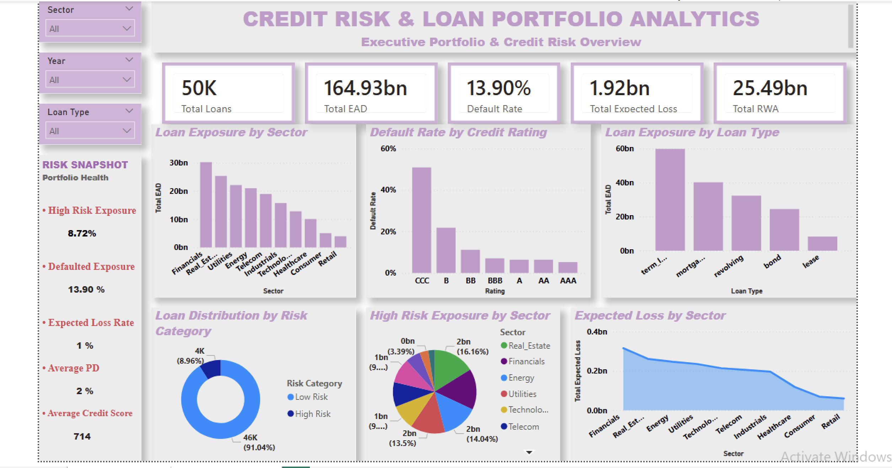
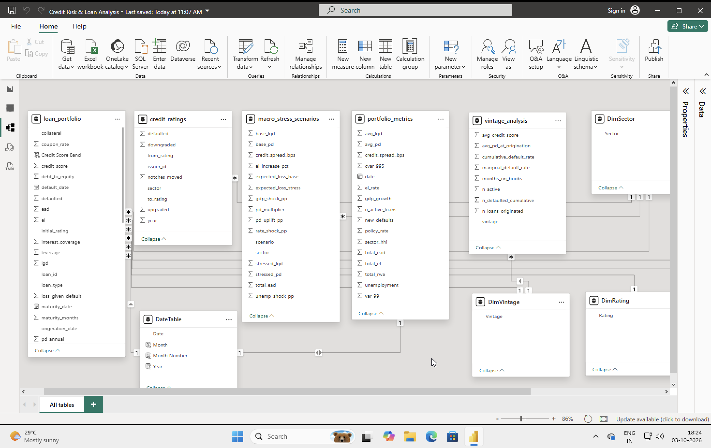
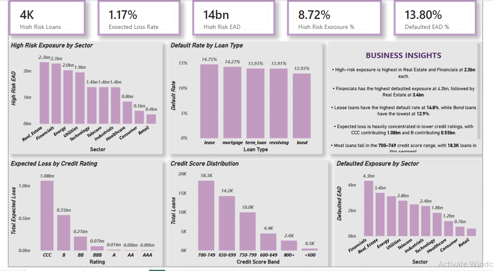

# 📊 Credit Risk & Loan Portfolio Analytics

<p align="center">
  
</p>

<p align="center">
  <strong>End-to-End Credit Risk & Loan Portfolio Analytics Dashboard using Power BI</strong>
</p>

<p align="center">
  
  
  
  
  
</p>

<p align="center">
  
  
  
</p>

---

## 📌 Project Overview

The **Credit Risk & Loan Portfolio Analytics Dashboard** is an end-to-end Power BI project designed to analyze loan portfolio exposure, credit risk, defaults, expected losses, and risk-weighted assets.

The project transforms loan-level financial data into an interactive business intelligence solution that helps analyze:

- Portfolio exposure
- Credit risk concentration
- Default patterns
- Expected credit losses
- Risk-weighted exposure
- Credit rating distribution
- Borrower credit quality
- Sector and loan-type risk

The primary objective was not just to create visualizations, but to build a **business-focused credit risk analytics solution** using data cleaning, dimensional modeling, DAX and interactive Power BI reporting.

---

## 🎯 Business Problem

Financial institutions need continuous visibility into their loan portfolios to understand where risk and exposure are concentrated.

This dashboard addresses questions such as:

- Where is the portfolio exposure concentrated?
- Which sectors have higher high-risk exposure?
- Which sectors contribute the most defaulted exposure?
- Which loan types have higher default rates?
- Which credit ratings contribute the most expected loss?
- What percentage of portfolio exposure is classified as high risk?
- How is borrower credit quality distributed?
- What is the overall expected loss and RWA of the portfolio?

---

## 📊 Portfolio Snapshot

| KPI | Value |
|---|---:|
| **Total Loans** | 50K+ |
| **Total EAD** | 164.93 Bn |
| **Default Rate** | 13.90% |
| **Expected Loss** | 1.92 Bn |
| **Risk-Weighted Assets** | 25.49 Bn |
| **High-Risk Exposure** | 8.72% |

> **EAD** = Exposure at Default  
> **PD** = Probability of Default  
> **LGD** = Loss Given Default  
> **RWA** = Risk-Weighted Assets

---

# 🛠️ Tools & Technologies

<p align="center">
  
  
  
  
  
</p>

### Core Skills

- Power BI
- Power Query
- DAX
- Data Modeling
- Data Cleaning
- Data Transformation
- Financial Analytics
- Credit Risk Analytics
- Portfolio Analysis
- Business Intelligence
- Data Visualization
- Data Storytelling

---

# 🗂️ Dataset

The project uses multiple datasets representing loan-level portfolio information and supporting risk analysis.

### Main Datasets

| Dataset | Purpose |
|---|---|
| `loan_portfolio.csv` | Loan-level portfolio and credit-risk information |
| `credit_ratings.csv` | Credit rating information |
| `macro_stress_scenarios.csv` | Macroeconomic stress scenario information |
| `portfolio_metrics.csv` | Portfolio-level metrics |
| `vintage_analysis.csv` | Vintage-level portfolio analysis |

### Loan Portfolio Attributes

The primary loan portfolio contains attributes such as:

- Loan ID
- Origination Date
- Maturity Date
- Maturity Months
- Sector
- Loan Type
- Collateral
- Initial Rating
- Credit Score
- EAD
- Coupon Rate
- Leverage
- Interest Coverage
- Debt-to-Equity
- Annual PD
- LGD
- Expected Loss
- Unexpected Loss
- RWA
- Default Status
- Default Date
- Survival Months
- Recovery Rate
- Loss Given Default

---

# 🧹 Data Preparation & Transformation

Data preparation was performed using **Power Query**.

### Data Cleaning

- Validated column data types
- Checked missing values
- Checked duplicate records
- Standardized date fields
- Validated numeric and categorical fields
- Reviewed risk-related attributes
- Preserved expected null values for non-defaulted loans

For example, fields such as:

```text
default_date
recovery_rate
loss_given_default
```

### Analytical / Fact Tables

- `loan_portfolio`
- `credit_ratings`
- `portfolio_metrics`
- `vintage_analysis`
- `macro_stress_scenarios`

The model uses appropriate **one-to-many relationships** and **single-direction filtering** where applicable to maintain predictable filter propagation and analytical consistency.

### Data Model

<p align="center">
  
</p>

---

## 🧮 DAX Analysis

DAX was used to create portfolio KPIs, credit-risk metrics, and analytical classifications.

### Portfolio KPIs

- Total Loans
- Total EAD
- Defaulted Loans
- Default Rate
- Total Expected Loss
- Total RWA
- Total Unexpected Loss

### Credit Risk Metrics

- Average PD
- Average LGD
- Average Credit Score
- High Risk Loans
- High Risk EAD
- High Risk Exposure %
- Defaulted EAD
- Defaulted EAD %
- Expected Loss Rate
- RWA to EAD %

### Risk Classification

Loans were categorized using annual Probability of Default:

| Risk Category | PD Threshold |
|---|---:|
| **High Risk** | ≥ 10% |
| **Medium Risk** | ≥ 5% and < 10% |
| **Low Risk** | < 5% |

### Calculated Columns

- Vintage
- Risk Category
- Credit Score Band

Detailed DAX formulas are documented in:

`DAX/DAX_Measures.md`

---

## 📈 Dashboard

### 1️⃣ Executive Overview

The Executive Overview provides a high-level view of portfolio health and exposure.

#### Key KPIs

- Total Loans
- Total EAD
- Default Rate
- Expected Loss
- RWA

#### Key Visualizations

- Loan Exposure by Sector
- Default Rate by Credit Rating
- Loan Exposure by Loan Type
- Loan Distribution by Risk Category
- Portfolio Risk Snapshot

<p align="center">
  
</p>

---

### 2️⃣ Credit Risk Deep Dive

The Credit Risk Deep Dive focuses on identifying areas of higher credit risk and default exposure.

#### Key KPIs

- High Risk Loans
- High Risk EAD
- High Risk Exposure %
- Defaulted EAD %
- Expected Loss Rate

#### Key Visualizations

- High Risk Exposure by Sector
- Default Rate by Loan Type
- Expected Loss by Credit Rating
- Credit Score Distribution
- Defaulted Exposure by Sector

<p align="center">
  
</p>

---

## 💡 Key Business Insights

The dashboard provides visibility into several portfolio-level risk patterns.

### Portfolio Exposure

Portfolio exposure is distributed across multiple sectors, allowing users to identify sectors with higher concentration of lending exposure.

### High-Risk Exposure

High-risk exposure represents **8.72% of total portfolio EAD**, providing a portfolio-level view of exposure associated with higher annual PD.

### Default Exposure

Defaulted exposure can be analyzed by sector and loan type to identify areas requiring closer portfolio monitoring.

### Credit Rating Risk

Expected loss is concentrated across lower credit-rating segments, highlighting the relationship between credit quality and potential portfolio loss.

### Credit Score Distribution

Credit score bands provide an additional view of borrower credit quality and help identify where the majority of loans are positioned across the credit-score spectrum.

---

## 🔍 Analytical Approach

The project follows an end-to-end analytics workflow:

```text
Raw Data
   ↓
Data Cleaning
   ↓
Power Query Transformation
   ↓
Data Modeling
   ↓
DAX Measures & Calculated Columns
   ↓
Risk Classification
   ↓
Interactive Dashboard
   ↓
Business Insights
```

📁 Repository Structure

credit-risk-loan-portfolio-analytics/
│
├── 📁 Dashboard/
│   ├── Credit Risk & Loan Analysis.pbix
│   ├── Executive_Overview.png
│   └── Credit_Risk_Deep_Dive.png
│
├── 📁 Data/
│   ├── credit_ratings.csv
│   ├── loan_portfolio.csv
│   ├── macro_stress_scenarios.csv
│   ├── portfolio_metrics.csv
│   └── vintage_analysis.csv
│
├── 📁 Documentation/
│   ├── data_model.png
│   └── credit_risk_column_descriptions.txt
│
├── 📁 DAX/
│   └── DAX_Measures.md
│
└── 📄 README.md

🚀 Skills Demonstrated

This project demonstrates practical experience in:

Power BI Dashboard Development
Power Query
DAX
Dimensional Data Modeling
Data Cleaning
Data Transformation
Credit Risk Analysis
Financial Analytics
Portfolio Risk Analysis
KPI Development
Business Intelligence
Data Visualization
Business-focused Data Storytelling
📚 Key Credit Risk Concepts
Probability of Default — PD

The probability that a borrower will default within a specified period.

Loss Given Default — LGD

The percentage of exposure expected to be lost if a borrower defaults, after considering recoveries.

Exposure at Default — EAD

The amount of exposure expected to be outstanding when a borrower defaults.

Expected Loss — EL

Expected credit loss can be conceptually represented as:

Expected Loss = PD × LGD × EAD
Risk-Weighted Assets — RWA

RWA represents assets adjusted for their associated credit risk and is used in capital-risk analysis.

🎓 What I Learned

Through this project, I strengthened my understanding of:

Building Power BI data models
Designing dimension and fact-style structures
Creating reusable DAX measures
Applying filter context
Creating risk classifications
Analyzing credit exposure
Designing executive-level dashboards
Converting financial data into business insights
Presenting analytical findings through data storytelling
